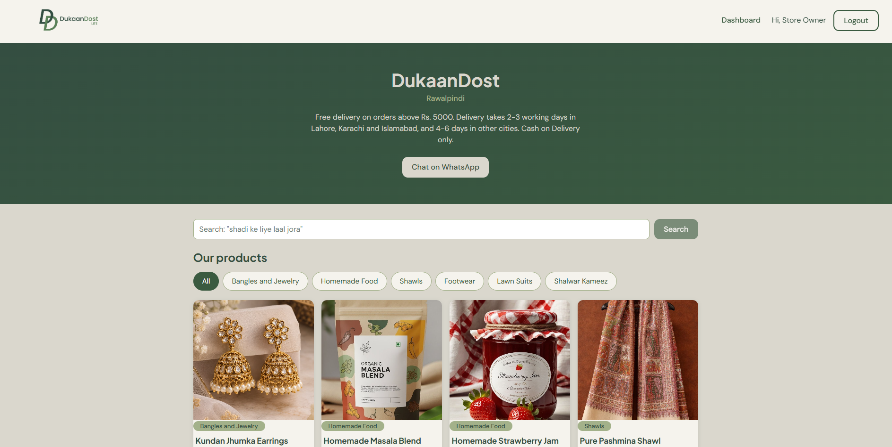
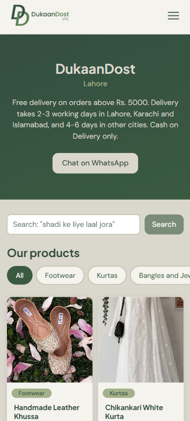
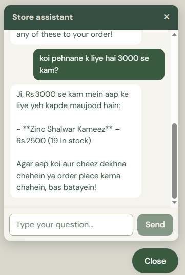
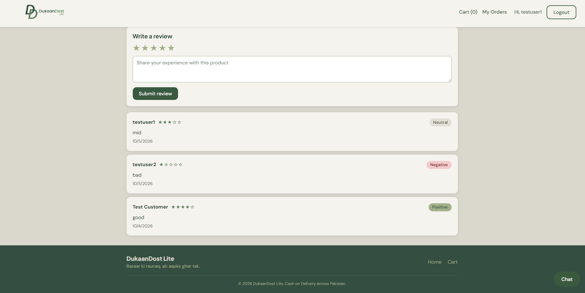
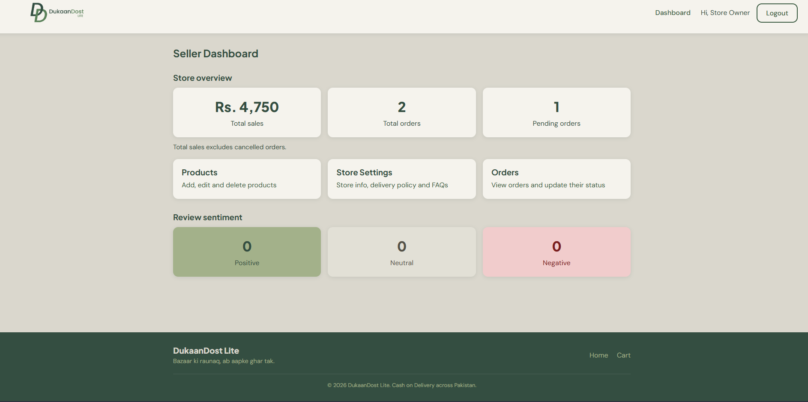

# DukaanDost Lite — Zohaib Khalid

A full-stack online store for a small Pakistani business, with an AI store assistant that answers in English, Urdu and Roman Urdu, and sentiment analysis of customer reviews.

## 1. Tech Stack

- Frontend: React (Vite), React Router, Axios, plain CSS
- Backend: Node.js, Express.js
- Database: MongoDB with Mongoose
- Authentication: JWT and bcrypt (built manually)
- LLM: Groq, model `openai/gpt-oss-120b` (called only from the backend)
- Hugging Face: `cardiffnlp/twitter-xlm-roberta-base-sentiment` (Inference API)

## 2. Features Implemented

| ID | Feature | Status |
|----|---------|--------|
| F01 | Authentication and Roles | Done |
| F02 | Products and Store Settings | Done |
| F03 | Storefront, Cart and Checkout | Done |
| F04 | Order Management | Done |
| F05 | AI Store Assistant (LLM) | Done |
| F06 | Reviews and Sentiment Analysis | Done |
| B02 | Smart Semantic Search (bonus) | Done |
| B04 | Seller Dashboard cards (bonus) | Done |

## 3. AI Features and Models Used

**AI Store Assistant (F05).** The chat widget calls `POST /api/chat` with the new message and the last 10 messages. For every message the backend loads the products (title, price, stock, category) and the store settings (delivery policy, FAQs, WhatsApp number) from MongoDB, builds a system prompt from them, and sends it to Groq. The assistant answers in the customer's language, refuses off-topic questions, and says it does not know (and suggests WhatsApp) when the information is missing. The API key stays in `backend/.env`, and the call is wrapped in try/catch with a friendly error message. Code: `backend/src/services/ai/`. Prompts: `docs/ai-prompts.md`.

**Review sentiment (F06).** When a review is submitted, the backend sends its text to the Hugging Face model `cardiffnlp/twitter-xlm-roberta-base-sentiment` through the Inference API. The label with the highest score (positive, neutral or negative) is saved with the review. If the model is unavailable, the review is still saved without a sentiment.

**Smart search (B02).** Product text is converted to embeddings with `sentence-transformers/paraphrase-multilingual-MiniLM-L12-v2` (Hugging Face Inference API), stored on the product, and ranked against the search query by cosine similarity. If the model is unavailable, the search falls back to keyword matching.

## 4. How to Run Locally

Requirements: Node.js 18 or newer, and MongoDB running locally (or a MongoDB Atlas connection string). A Groq API key and a Hugging Face token are needed for the AI features. The rest of the store works without them.

**Backend**

```bash
cd backend
npm install
cp .env.example .env
```

Open `backend/.env` and fill it in (see section 5). A ready-to-use local setup:

```text
PORT=5000
MONGO_URI=mongodb://127.0.0.1:27017/dukaandost
JWT_SECRET=any_long_random_text
CLIENT_URL=http://localhost:5173
GROQ_API_KEY=your_groq_key
GROQ_MODEL=openai/gpt-oss-120b
HF_TOKEN= Huggin_face_token
HF_SENTIMENT_MODEL=cardiffnlp/twitter-xlm-roberta-base-sentiment
HF_EMBEDDING_MODEL=sentence-transformers/paraphrase-multilingual-MiniLM-L12-v2
```

Then create the test data and start the server:

```bash
npm run seed
npm run dev
```

`npm run seed` resets the database and creates the test accounts, store settings, 9 products and 2 orders. The API runs on http://localhost:5000.

**Frontend** (in a second terminal)

```bash
cd frontend
npm install
npm run dev
```

Open http://localhost:5173. The frontend needs no `.env` file when the backend runs on port 5000.

## 5. Environment Variables

Backend (`backend/.env`, see `backend/.env.example`):

| Variable | Purpose |
|----------|---------|
| PORT | Port of the API server |
| MONGO_URI | MongoDB connection string |
| JWT_SECRET | Secret used to sign login tokens |
| CLIENT_URL | Allowed frontend origin(s) for CORS, comma separated |
| GROQ_API_KEY | API key for the Groq LLM (backend only) |
| GROQ_MODEL | Groq model name used by the assistant |
| HF_TOKEN | Hugging Face access token |
| HF_SENTIMENT_MODEL | Hugging Face model for review sentiment |
| HF_EMBEDDING_MODEL | Hugging Face model for smart search |

Frontend (`frontend/.env.example`, optional):

| Variable | Purpose |
|----------|---------|
| VITE_API_URL | API address (defaults to http://localhost:5000/api) |

## 6. Test Accounts

| Role | Email | Password |
|------|-------|----------|
| Seller | seller@test.com | Test@1234 |
| Customer | customer@test.com | Test@1234 |

The customer has one Delivered order (so reviews can be tested) and one Pending order (so cancelling can be tested).

## 7. API Endpoints

The full list with request bodies and example responses is in [docs/api-docs.md](docs/api-docs.md). Summary:

- Auth: `POST /api/auth/register`, `POST /api/auth/login`, `GET /api/auth/me`
- Settings: `GET /api/settings`, `PUT /api/settings` (seller)
- Products: `GET /api/products?category=`, `GET /api/products/:id`, `POST` / `PUT` / `DELETE /api/products/:id` (seller)
- Orders: `POST /api/orders`, `GET /api/orders/my`, `GET /api/orders` (seller), `PATCH /api/orders/:id/status` (seller), `PATCH /api/orders/:id/cancel`
- AI: `POST /api/chat`
- Reviews: `POST /api/reviews`, `GET /api/products/:id/reviews`
- Extra: `GET /api/reviews/stats` (seller), `GET /api/orders/stats` (seller), `GET /api/products/search?q=`

## 8. Screenshots







## 9. Demo Video

https://PASTE-VIDEO-LINK-HERE

## 10. AI Tools Used During Development

- Claude (Anthropic): step-by-step guidance, code generation, debugging and explanations for the backend, frontend, AI integration, styling and documentation. I tested the code and adapted it to the project requirements.
- Groq (`openai/gpt-oss-120b`) and Hugging Face models are part of the application itself and are described in section 3.

## 11. Known Issues and Limitations

- Registration accepts only specific email providers (Gmail, Outlook, Hotmail, Live, Yahoo, iCloud, test.com, example.com), and passwords need at least 6 characters with one special character.
- The chat endpoint is public and has no rate limiting.
- Product images use image URLs (no file upload).
- If the Hugging Face or Groq service is unavailable, reviews are saved without a sentiment, search falls back to keywords, and the chat shows a friendly error.
- Stock changes are not wrapped in a database transaction; the code undoes partial changes manually if an order fails halfway.